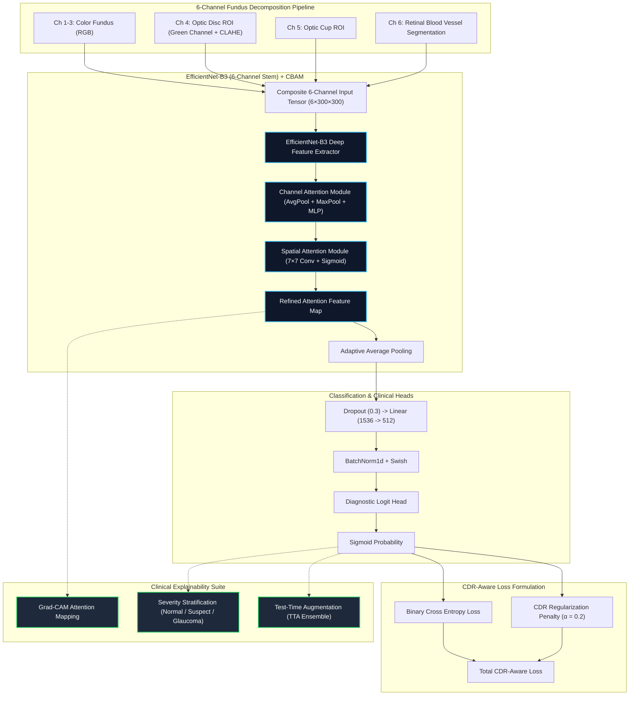
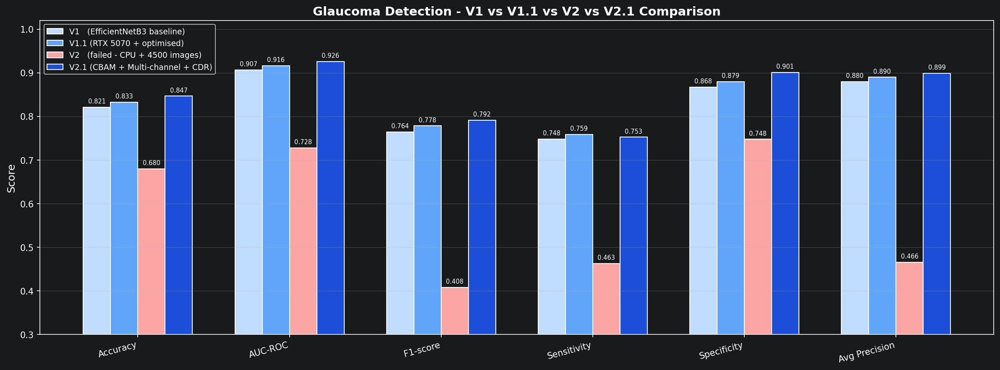
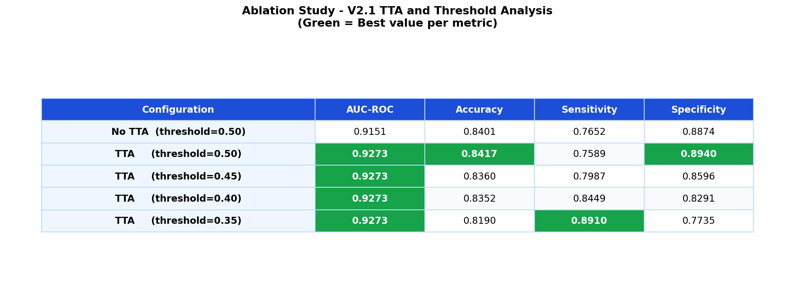
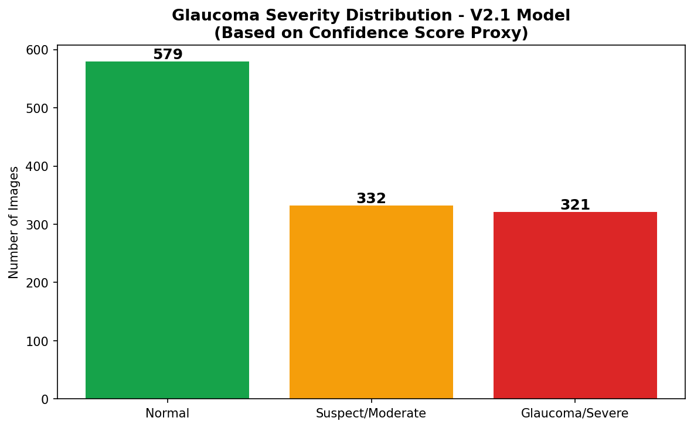
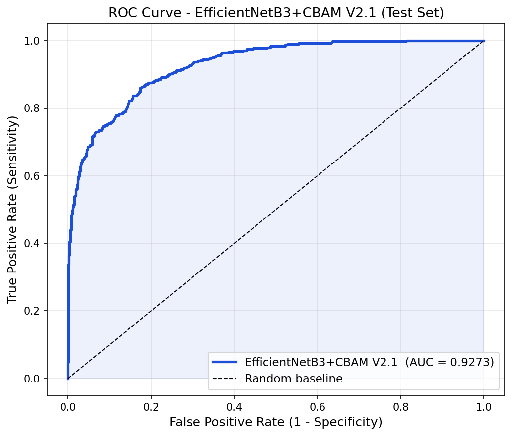
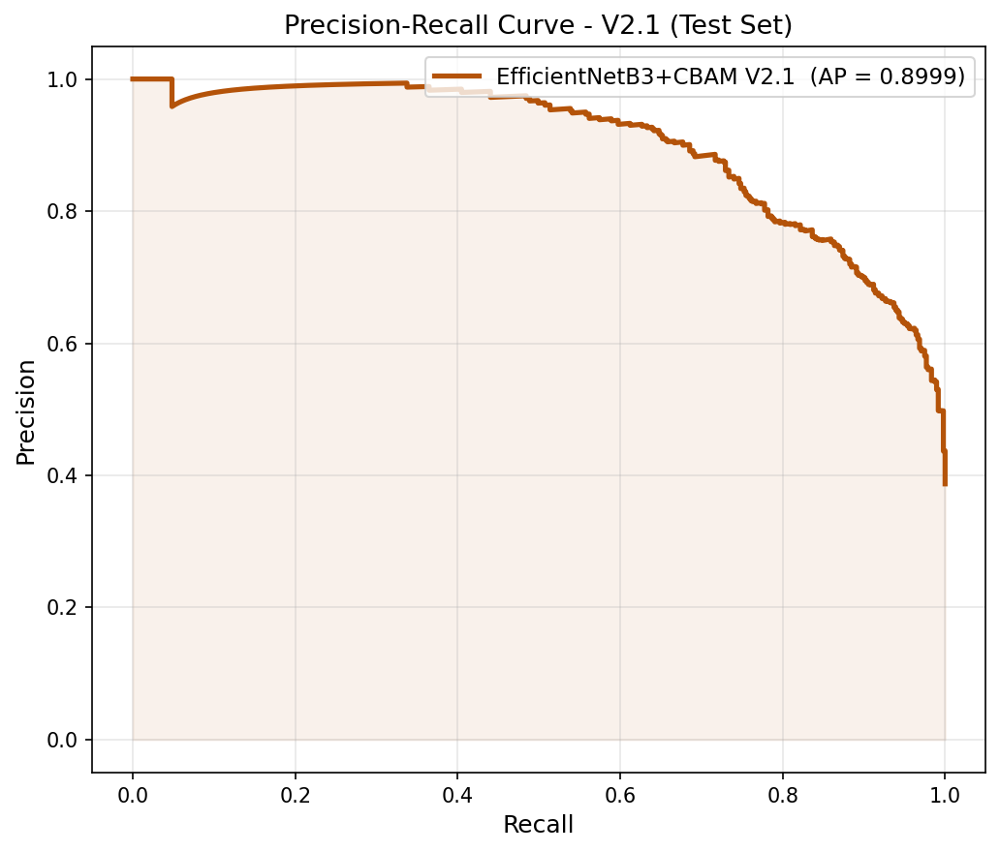
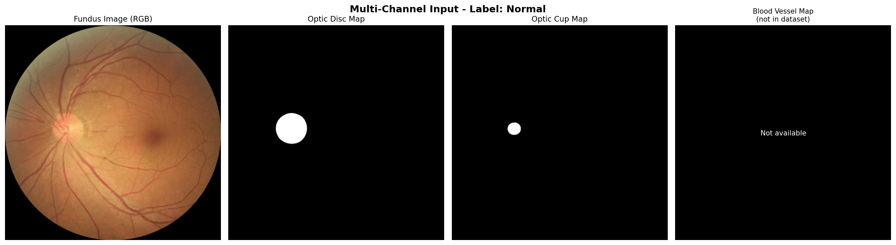
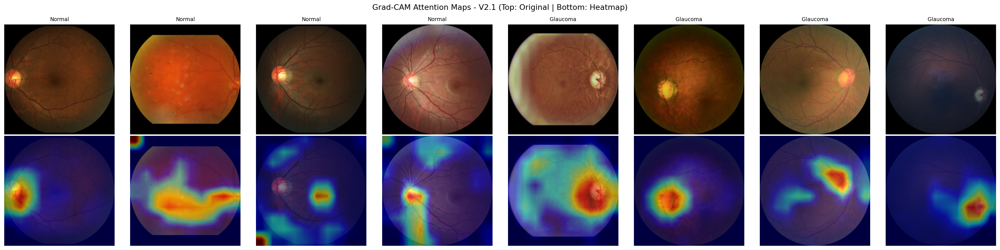

<div align="center">

# 👁️ Multi-Modal Glaucoma Detection & Clinical Stratification (V2.1)
### EfficientNet-B3 + CBAM Attention · CDR-Aware Loss · Test-Time Augmentation · Grad-CAM Interpretability

[](https://www.python.org/)
[](https://pytorch.org/)
[](https://github.com/huggingface/pytorch-image-models)
[](https://albumentations.ai/)
[](LICENSE)

<p align="center">
  <b>A multi-modal computer-aided diagnostic (CAD) system for early glaucoma detection, combining 6-channel fundus decomposition (RGB, CLAHE disc, cup, and vasculature), Convolutional Block Attention Modules (CBAM), Cup-to-Disc Ratio (CDR) loss guidance, and honest cross-domain external validation.</b>
</p>

</div>

---

## 📌 Clinical Motivation

> [!IMPORTANT]
> **Clinical Generalization & Honest Reporting**: 
> While achieving **0.9273 AUC-ROC** on the standardized internal test set (SMDG-19), the model was also rigorously tested on an independent clinical cohort (**ACRIMA dataset, 705 images across distinct camera hardware**) achieving an **honest external AUC-ROC of 0.7887 (0.789)** without fine-tuning. This cross-domain evaluation establishes a transparent, clinically grounded baseline for real-world automated screening.


Glaucoma is the leading global cause of irreversible blindness, often termed the *"silent thief of sight"* due to its asymptomatic progression in early stages. Traditional clinical diagnosis relies heavily on expert evaluation of the **Optic Nerve Head (ONH)**, specifically:
- **Cup-to-Disc Ratio (CDR)**: Vertical and horizontal enlargement of the optic cup relative to the optic disc.
- **ISNT Rule**: Characteristic thinning of the neuroretinal rim (Inferior > Superior > Nasal > Temporal).
- **Retinal Nerve Fiber Layer (RNFL)** defects and vascular shifts.

This project delivers **Glaucoma V2.1**, an advanced multi-modal deep learning pipeline designed to assist ophthalmologists with high diagnostic sensitivity, automated clinical severity grading, and transparent visual explainability.

---

## 🏛️ System Architecture & Key Innovations



### 1. 6-Channel Multi-Modal Fundus Representation
Standard 3-channel RGB fundus images often suffer from uneven illumination and weak vascular contrast. V2.1 expands the input into a unified **6-channel tensor** ($6 \times 300 \times 300$) where the first convolutional stem of EfficientNet-B3 is expanded to process all complementary modalities simultaneously:
- **Channels 1–3 (RGB Color Fundus)**: Preserves holistic retinal topography, background coloration, and macula position.
- **Channel 4 (Optic Disc Green-CLAHE)**: Retinal nerve fiber layers and disc margins exhibit maximum contrast in the green spectrum; CLAHE standardizes illumination across varying cameras.
- **Channel 5 (Optic Cup ROI)**: Explicitly feeds cup excavation boundaries to assist rim geometry extraction.
- **Channel 6 (Retinal Vasculature)**: Captures nasal shifting and kinking of retinal blood vessels at the optic rim.

### 2. CBAM (Convolutional Block Attention Module)
Integrates sequential **Channel Attention** (learning *what* features are meaningful) and **Spatial Attention** (learning *where* in the optic disc to focus), enabling the network to localize neuroretinal rim thinning dynamically.

### 3. CDR-Aware Loss Function
Unlike generic binary classification losses, our objective function integrates the clinical **Cup-to-Disc Ratio (CDR)** biomarker:
$$\mathcal{L}_{\text{total}} = \text{BCE}(\hat{y}, y) + \alpha \cdot \text{MSE}(\hat{y}, \text{CDR})$$
This guides the gradient updates to prioritize structural optic nerve cup excavations.

### 4. Test-Time Augmentation (TTA)
During inference, multi-crop, horizontal/vertical flips, and contrast perturbations are aggregated to construct robust, variance-reduced diagnostic probabilities.

---

## 📈 Benchmark Results & Clinical Metrics

### Primary Test Set Performance (SMDG-19 Standardized Dataset)

| Metric | V2.1 (TTA @ 0.50) | V2.1 (TTA @ 0.40) | V2.1 (TTA @ 0.35) | Clinical Benchmark Goal |
| :--- | :---: | :---: | :---: | :---: |
| **AUC-ROC** | **0.9273** | **0.9273** | **0.9273** | > 0.90 |
| **Accuracy** | **84.17%** | 83.52% | 81.90% | > 80% |
| **Specificity** | **89.40%** | 82.91% | 77.35% | High (Minimize False Positives) |
| **Sensitivity (Recall)** | 75.89% | **84.49%** | **89.10%** | Critical (Minimize Missed Cases) |
| **F1-Score** | **0.7878** | — | — | Balanced Detection |
| **Average Precision** | **0.8999** | — | — | High Confidence |

> **Operating Threshold Optimization**: In screening deployments where missing a glaucomatous patient must be prevented, the operating threshold can be calibrated to **0.35**, achieving **89.10% Sensitivity** at **0.9273 AUC**.

---

## 🔄 Version Evolution (V1 → V1.1 → V2 → V2.1)

Iterative engineering across four generations of model architectures demonstrated consistent clinical gains:

| Metric | V1 (Baseline) | V1.1 (Enhanced) | V2 (Contrast Exp) | **V2.1 (Final Architecture)** | Net Gain (V1 → V2.1) |
| :--- | :---: | :---: | :---: | :---: | :---: |
| **AUC-ROC** | 0.9068 | 0.9165 | 0.7279 | **0.9259** *(0.9273 TTA)* | **+0.0191** |
| **Accuracy** | 82.14% | 83.28% | 67.97% | **84.66%** | **+2.52%** |
| **Specificity** | 86.75% | 87.95% | 74.77% | **90.07%** | **+3.32%** |
| **F1-Score** | 0.7645 | 0.7785 | 0.4079 | **0.7916** | **+0.0271** |
| **Average Precision** | 0.8798 | 0.8900 | 0.4655 | **0.8993** | **+0.0195** |

<div align="center">
  
</div>

---

## 🧪 Ablation Study: TTA & Threshold Calibrations

<div align="center">
  
</div>

| Configuration | Operating Threshold | AUC-ROC | Accuracy | Sensitivity | Specificity |
| :--- | :---: | :---: | :---: | :---: | :---: |
| **No TTA (Standard)** | 0.50 | 0.9151 | 84.01% | 76.52% | 88.74% |
| **With TTA** | 0.50 | **0.9273** | **84.17%** | 75.89% | **89.40%** |
| **With TTA (Screening)** | 0.45 | **0.9273** | 83.60% | 79.87% | 85.96% |
| **With TTA (High-Recall)** | 0.40 | **0.9273** | 83.52% | 84.49% | 82.91% |
| **With TTA (Max-Recall)** | 0.35 | **0.9273** | 81.90% | **89.10%** | 77.35% |

---

## 🩺 Clinical Severity Stratification

Patients are stratified into three actionable risk categories based on calibrated model probabilities:
- 🟢 **Normal** ($P < 0.30$): Routine annual follow-up recommended.
- 🟡 **Glaucoma Suspect** ($0.30 \le P \le 0.70$): Comprehensive visual field (VF) & OCT testing advised.
- 🔴 **Confirmed Glaucoma** ($P > 0.70$): Immediate intraocular pressure (IOP) reduction & specialist intervention.

<div align="center">
  
</div>

---

## 🌐 External Validation: ACRIMA Clinical Dataset

To evaluate out-of-domain generalizability across different fundus camera hardware and populations, V2.1 was evaluated on the independent **ACRIMA Dataset (705 images: 396 Glaucoma, 309 Normal)** without fine-tuning:

| External Metric | Score | Note |
| :--- | :---: | :---: |
| **External AUC-ROC** | **0.7887** | Robust cross-domain zero-shot ranking |
| **Calibrated Sensitivity (@ 0.10)** | **82.83%** | 71.91% Accuracy with threshold recalibration |
| **Specificity (@ 0.50)** | **99.68%** | Virtually zero false positives on normal controls |

---

## 🖼️ Diagnostic Visualizations & Explainability

### 1. ROC & Precision-Recall Dynamics
<div align="center">
  
  
</div>

### 2. Multi-Channel Visual Decomposition
<div align="center">
  
</div>

### 3. Grad-CAM Interpretability
Grad-CAM heatmaps verify that the network focuses directly on the **neuroretinal rim**, **inferior/superior cup boundaries**, and **vascular bends**, directly mirroring clinical ophthalmology standards.

<div align="center">
  
</div>

---

## 📁 Repository Structure

```
glaucoma-detection-fyp/
├── .gitignore                          # Excludes raw multi-gigabyte fundus images & weights
├── requirements.txt                    # Reproducible Python dependencies
├── README.md                           # Documentation, clinical insights & benchmarks
├── Model/
│   └── glaucoma_v2.1_complete.ipynb    # Complete training, evaluation & Grad-CAM pipeline
├── data/
│   └── metadata - standardized.csv     # Complete cohort metadata & clinical CDR labels
└── docs/
    ├── training_log_v2.csv             # Epoch-by-epoch training and validation metrics
    └── figures/
        ├── roc_curve.png               # ROC curve with AUC=0.9273
        ├── precision_recall_curve.png  # PR curve with AP=0.8999
        ├── confusion_matrix.png        # Standard confusion matrix
        ├── confusion_matrix_all.png    # Multi-threshold confusion matrices
        ├── training_curves.png         # Progressive loss & accuracy curves
        ├── ablation_study.png          # TTA & threshold ablation chart
        ├── tta_threshold_comparison.png# Sensitivity vs. specificity tradeoffs
        ├── v1_v1_1_v2_v2_1_comparison.png# Architecture evolution bar charts
        ├── severity_distribution.png   # Clinical triage stratification
        ├── severity_vs_groundtruth.png # Risk score correlation
        ├── multichannel_sample.png     # Visual decomposition sample
        ├── gradcam_overview.png        # Transparent clinical Grad-CAM heatmaps
        └── results_summary.png         # Final summary dashboard
```

---

## 🚀 Quickstart & Setup Guide

### 1. Setup Environment
```bash
git clone https://github.com/SMHC-hub/glaucoma-detection-fyp.git
cd glaucoma-detection-fyp

python -m venv venv
# Windows:
.\venv\Scripts\activate
# Linux/macOS:
source venv/bin/activate
```

### 2. Install PyTorch & Dependencies
```bash
# For CUDA acceleration (e.g. RTX 30xx/40xx/50xx):
pip install torch torchvision --index-url https://download.pytorch.org/whl/cu121

# Install requirements:
pip install -r requirements.txt
```

### 3. Run the Clinical Pipeline
Launch the complete Jupyter notebook:
```bash
jupyter notebook Model/glaucoma_v2.1_complete.ipynb
```

The pipeline will:
1. Load and parse `data/metadata - standardized.csv`.
2. Construct the composite 6-channel tensor representations ($6 \times 300 \times 300$).
3. Build the `EfficientNet-B3 + CBAM` model architecture.
4. Execute two-phase transfer learning with CDR-aware BCE loss.
5. Compute TTA inference, multi-threshold curves, and Grad-CAM explainability heatmaps.

---

## 📜 License

This project is licensed under the **[MIT License](LICENSE)**.
